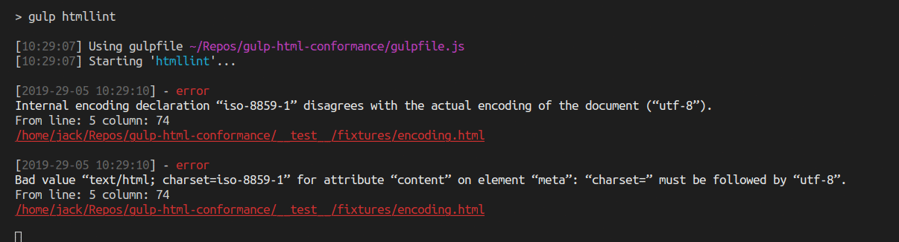

[](https://opensource.org/licenses/MIT)    

# Gulp-html-conformance

Gulp plugin for checking out whether html files conform to the HTML spec (with the help of [v.Nu](https://validator.github.io/validator/) checker) or your formatting preferences (with the help of [HTMLHint](https://github.com/htmlhint/HTMLHint)).


### Prerequisites

1. [Node](https://nodejs.org/en/) engine >= 8.2.0
2. [Gulp](https://gulpjs.com/) task runner
3. The Nu Html Checker requires an environment with Java 8 or above.
   [How to install on Windows, Mac OS & Ubuntu](https://www3.ntu.edu.sg/home/ehchua/programming/howto/JDK_Howto.html)

### Installing

```
npm i -D gulp-html-conformance
```

### Usage

This plugin supports a lot of options for Nu Checker and HTMLHint, but you can also use it without any options, in which case the default options will be used. <br/>
[See options for v.Nu](https://validator.github.io/validator/#options) <br/>
[See options for HTMLHint](https://github.com/htmlhint/HTMLHint/wiki/Rules) <br/>
[Default rulesset for HTMLHint](https://github.com/htmlhint/HTMLHint/wiki/Usage#about-rules)<br/>
:no_entry_sign: Please, do not mix the compilation process with the linting. Any lint tool in such a case needs a final compilation result. The gulp pipes look like they are performed synchronously, but this is not so! [Do not do this..](https://github.com/validator/gulp-html/issues/12) [Do this instead..](https://gulpjs.org/recipes/running-tasks-in-series.html):thumbsup:

#### Examples

##### 1.Without options:

```js
const gulp = require('gulp');
const conform = require('gulp-html-conformance');

gulp.task('lintHtml', () =>
  gulp
    .src('./src/*.html')
    .pipe(conform())
    .pipe(gulp.dest('./dest'))
);
```

##### 2. With options:

```js
// Example for options object.
// This object can contain three top-level keys and any of them can be omitted.
{
  logToFile: './pathtologfile',
  vnu:{
   // ... v.Nu options here
  },
  htmlhint:{
    // ... HTMLHint options here
  }
}
```

Some comments on "vnu" options:<br/>

- The "version" and "verbose" options will always fall back to false. These options are of little use, but cause some problems, so they are disabled. The "verbose" option just prints path to file being checked, anyway this plugin does it by itself.
- There is no need to set the "format" option for v.<span></span>Nu, this option will always be "json". Other formats for v.<span></span>Nu are not supported, as they are useless for console output but require parsing, formatting, and so on. If for some reason you need those formats, define the "logToFile" option with the path to log file, then you can parse that file to any format you need.
- The "user-agent" option will always be "Validator<span></span>.nu/LV". Checking HTTPS/HTTP URLs is not supported.
- To avoid confusion with regular expressions, always use the recommended pattern for "filterpattern" option, like this: '.\*someword.\*'. If you want to filter multiple messages, just define "filterfile" option and then filter out as many messages as you want.

```js
const gulp = require('gulp');
const conform = require('gulp-html-conformance');

gulp.task('lintHtml', () =>
  gulp
    .src('./src/*.html')
    .pipe(
      conform({
        logToFile: './logs/lintHtml.log',
        vnu: {
          filterpattern: '.*name.*'
        },
        htmlhint: {
          'space-tab-mixed-disabled': 'space'
        }
      })
    )
    .pipe(gulp.dest('./dest'))
);
```

### See also

[gulp-html](https://github.com/validator/gulp-html) :arrow_backward: source of inspiration<br/>
[gulp-htmlhint](https://github.com/bezoerb/gulp-htmlhint)<br/>
